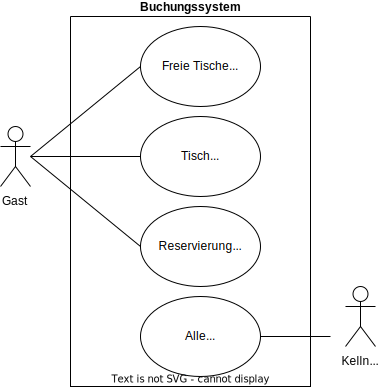

# Tischreservierung
Erste Schritte für die Entwicklung einer API mit Flask. [Flask](https://flask.palletsprojects.com/en/2.3.x/) ist ein Python-Webframework für das Backend, das HTTP-Requests zu Python-Funktionen zuordnet.

Nützliche Links:
- [Erste Schritte mit Flask](https://programminghistorian.org/en/lessons/creating-apis-with-python-and-flask#implementing-our-api)

## Auszug aus dem Lastenheft
Ein Restaurant möchte ein Buchungssystem für die Reservierung von Tischen einführen. Das Restaurant hat eine Filiale mit 20 Tischen. 

### Beschreibung des Ist-Zustands
Derzeit werden Reservierungen via Telefon geregelt. Kunden rufen an und geben einen gewünschten Zeitpunkt und ggf. eine Personenzahl an. Der Kellner überprüft, welche Tische für den jeweiligen Zeitpunkt in Frage kommen. Falls genügend Tische zur Verfügung stehen, wird die Reservierung mit den betroffenen Tischnummern und einem Namen, ggf. mit einer Telefnonummer in einen großen Terminplan eingetragen. 

Es hat sich als praktikabel gezeigt, dass eine Reservierung nur zur halben Stunde (z.B. 16:30 Uhr, 17:30 Uhr) angeboten werden und jeweils für eine Stunde gelten.

In einigen Fällen kommt es vor, dass Reservierungen telefonisch wieder storniert werden. 

### Beschreibung des Soll-Konzepts
Die Reservierung soll zukünftig nur noch über ein Buchungssystem erfolgen. Die Kunden sollen über unsere Webseite die freien Tische zu einem gewünschten Termin anzeigen können. Anschließend sollen sie die Tische reservieren und die Reservierung ggf. stornieren können. 

Vor Ort benötigen die Kellner nur Einblick über alle Reservierungen des aktuellen Tages, um Gäste zu ihren Tischen zu leiten.

Personenbezogene Daten sollen vorerst nicht erhoben werden.

Das System soll zukünftig erweiterbar sein, um z.B. mehrere Filialen einbinden zu können.

## Fachkonzept
Ausgehend von der Situationsbeschreibung wurde die Situation vertieft analysiert. Ergebnis waren mehrere UML-Diagramme.

### Anwendungsfalldiagramm
Das nachfolgende UML-Use-Case Diagramm zeigt die Anwendungsfälle, die das neue System zur Verfügung stellen soll.

### Sequenzdiagramm
Die Abfolge der Nachrichtenflüsse soll in einem UML-Sequenzdiagramm dargestellt werden:

### EDGAR & TIM
Zum starten:
- cd api
- python api.py

